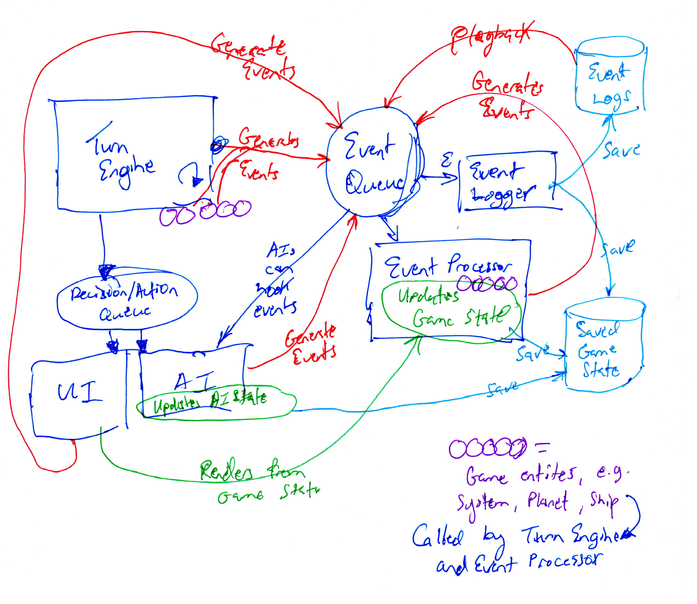

# Star-Squabble

## "Risk in Space"

A multiplayer turn-based 4X strategy game with units and combat inspired by Risk and with a 3D star map and traversable interstellar wormholes inspired by Ascendancy's starlanes.

Controlling territory is the primary objective like Risk, but there is also the traditional 4X "fog of war" where each player can only see the area that they've explored so far.

## Project Objectives

* Develop a streamlined and visually simple game to focus on the game architecture, AI, and gameplay.
* Experiment with event-based game architecture, pluggable AI, pluggable UI, and configurable UI+AI under player control (delegate specific tasks).
* Start out building a single-player vs. and with AI experience, but with an eye toward being multiplayer.

## Repo Organization

Project / Folder | Description & Status
-----------------|---------------------
EB-Game | Implementation of game core using event-based architecture approach
Design | Design notes, diagrams, references
Star Map Test | Test in Unity of creating and rendering random stars and wormholes. Also testing space skyboxes.

## Core Architecture Principles

* Separated and pluggable UI
* Event-based architecture
* Pluggable AI - Open and pluggable AI per player to enable rapid experimentation
* UI+AI gameplay: players decide which decisions to delegate to AI and choose AI(s) and AI settings

### Event-based architecture

## Technologies and Team

### Engine, Libraries, Services, Tools

* C# and Unity

### Team

* Eric Zocher (@ezocher)

## Game Design Document

Gameplay, game mechanics, and further architecture details are covered in the 
[Game Design Document](Design/Star-Squabble-GDD.md).
